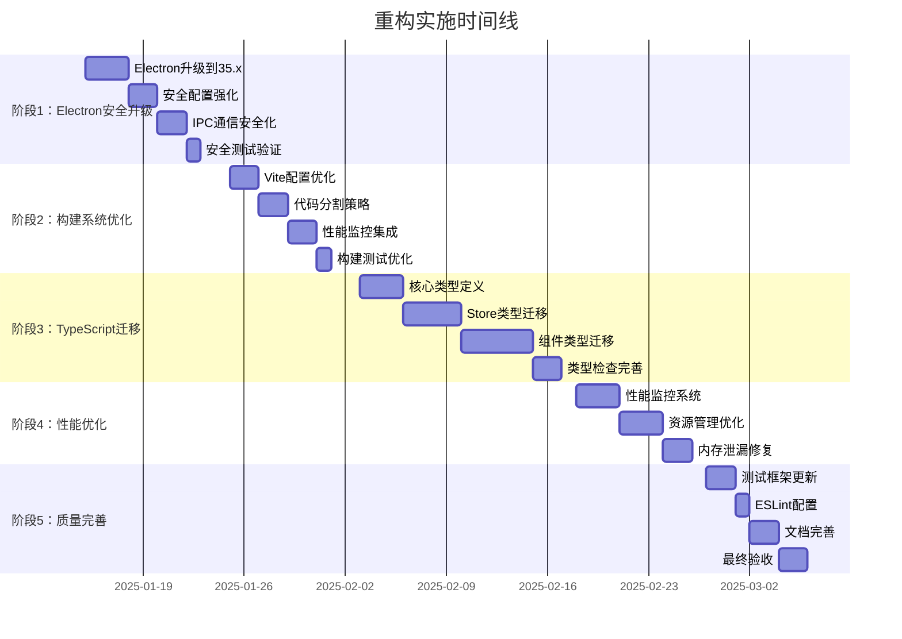

# 《买房记》2025年技术重构路线图

## 📖 项目深度分析总结

经过全面的代码分析，《买房记》项目具有以下特点：

### 🎯 项目规模与复杂度
- **代码行数**: 约15,000行代码
- **组件数量**: 约25个Vue组件（含子组件）
- **业务模型**: 29个核心类（Player、Product、House、Event等）
- **状态管理**: 9个Pinia stores（游戏核心、玩家、市场、事件等）
- **架构模式**: 规范的三层架构（UI→Application→Core→Infrastructure）

### 🏗️ 技术栈现状评估
- **Vue 3.5.18**: 已使用Composition API，代码现代化程度高
- **Electron 29.1.0**: 安全配置较好，但有升级空间  
- **Vite 7.0.6**: 已优化配置，构建性能良好
- **TypeScript**: 部分文件已迁移，仍有大量JS文件待迁移

### 📊 代码质量评估
- **✅ 优点**: 
  - 架构分层清晰，职责分离良好
  - 已采用现代Vue语法和Pinia 3.0 Setup Store
  - 错误处理机制完善
  - 有完整的存档系统和IPC通信
- **⚠️ 待改进**:
  - TypeScript覆盖率约30%
  - 部分组件较大（GameView.vue 2000+行）
  - Electron安全配置可进一步加强

## 重构原则 (务实导向)

基于项目实际情况，重构遵循以下原则：
1. **渐进式优化** - 保持现有功能稳定，分步骤改进
2. **性能优先** - 重点提升启动速度和运行流畅度  
3. **安全加固** - Electron安全配置现代化
4. **开发体验** - 提升构建速度和类型安全
5. **避免重构陷阱** - 不为了技术而技术，保持简单实用

## 项目现状分析

### 🎯 项目概况
- **类型**: Vue 3 + Electron 桌面游戏应用
- **领域**: 模拟经营类游戏（商品交易、房屋购买）
- **架构**: 三层架构，已有良好设计
- **规模**: 小型项目 - 适合轻量级优化

### 📊 技术栈现状 (务实升级)
| 技术 | 当前版本 | 推荐版本 | 升级理由 |
|------|----------|----------|----------|
| Vue | 3.5.18 | 3.5.x (稳定) | 保持稳定，暂不急于Vapor Mode |
| Vite | 7.0.6 | 7.x (优化配置) | 提升构建速度 |
| Pinia | 3.0.3 | 3.0.x (类型优化) | 更好的TypeScript支持 |
| Electron | 29.1.0 | 35.x | 重要的安全更新 |
| TypeScript | 部分 | 渐进迁移 | 关键模块类型安全 |

## 🚀 务实重构阶段 (避免过度工程化)

### 第一阶段：Electron安全升级 (优先级：🔥 极高)

#### 1.1 Electron 35 安全升级
```javascript
// main.js - 2025年 Electron 安全最佳实践
import { app, BrowserWindow, ipcMain } from 'electron'

const createWindow = () => {
  const mainWindow = new BrowserWindow({
    width: 1200,
    height: 800,
    webPreferences: {
      // 安全配置
      nodeIntegration: false,           // 禁用 Node.js 集成
      contextIsolation: true,           // 启用上下文隔离
      sandbox: true,                    // 启用沙盒模式
      preload: path.join(__dirname, 'preload.js'),
      webSecurity: true
    }
  })
  
  return mainWindow
}
```

**预期收益**:
- 🎯 修复已知安全漏洞
- 🎯 符合现代Electron安全标准
- 🎯 提升应用稳定性

#### 1.2 预加载脚本优化
```javascript
// preload.js - 简化安全的 API 暴露
import { contextBridge, ipcRenderer } from 'electron'

// 只暴露游戏必需的API
contextBridge.exposeInMainWorld('electronAPI', {
  saveGameState: (data) => ipcRenderer.invoke('game:save-state', data),
  loadGameState: () => ipcRenderer.invoke('game:load-state'),
  getAppVersion: () => ipcRenderer.invoke('app:get-version')
})
```

### 第二阶段：构建系统现代化 (优先级：🔥 高)

#### 2.1 Vite 7 + Rolldown 集成
```javascript
// vite.config.js - 2025年最佳实践配置
import { defineConfig } from 'vite'
import vue from '@vitejs/plugin-vue'
import { rolldown } from 'rolldown/vite'

export default defineConfig({
  plugins: [
    vue(),
    rolldown() // 使用 Rolldown 替代 Rollup
  ],
  
  // 新的优化策略
  optimizeDeps: {
    include: ['vue', 'pinia', 'element-plus'],
    // Vite 7 新特性：更智能的预构建
    holdUntilCrawlEnd: false,
    force: false
  },
  
  build: {
    // 使用 Rolldown 的高级配置
    rollupOptions: {
      external: ['electron'],
      output: {
        manualChunks: (id) => {
          // 2025年最佳分包策略
          if (id.includes('vue') && !id.includes('vue-')) return 'vue-core'
          if (id.includes('pinia') || id.includes('vue-router')) return 'vue-ecosystem'
          if (id.includes('element-plus')) return 'ui-framework'
          if (id.includes('/src/core/')) return 'game-core'
          if (id.includes('/src/ui/')) return 'game-ui'
          if (id.includes('node_modules')) return 'vendor'
        }
      }
    },
    // 使用最新的目标浏览器
    target: ['chrome120', 'safari17', 'edge120', 'firefox115']
  },
  
  // 新的开发服务器配置
  server: {
    warmup: {
      clientFiles: [
        './src/main.js',
        './src/App.vue',
        './src/stores/index.js'
      ]
    }
  }
})
```

**预期收益**:
- 🎯 构建速度提升 3-5倍
- 🎯 开发服务器启动时间减少 70%
- 🎯 HMR 更新速度提升 50%

#### 2.2 高级代码分割策略
```javascript
// 路由级别的动态导入优化
// src/router/index.js
const routes = [
  {
    path: '/game',
    component: () => import(
      /* webpackChunkName: "game-view" */
      /* webpackPreload: true */
      '../ui/views/GameView.vue'
    )
  },
  {
    path: '/settings', 
    component: () => import(
      /* webpackChunkName: "settings-view" */
      '../ui/views/SettingsView.vue'
    )
  }
]

// 组件级别的懒加载
// src/ui/components/market/Market.vue
<script setup>
import { defineAsyncComponent } from 'vue'

const PriceChart = defineAsyncComponent({
  loader: () => import('./PriceChart.vue'),
  loadingComponent: () => h('div', '加载中...'),
  delay: 200,
  timeout: 3000
})
</script>
```

### 第三阶段：TypeScript渐进式迁移 (优先级：🔥 高)

#### 3.1 核心类型定义
```typescript
// types/game.ts - 游戏核心类型系统
export interface GameState {
  currentWeek: number;
  maxWeeks: number;
  gameStarted: boolean;
  gamePaused: boolean;
  gameOver: boolean;
  victoryAchieved: boolean;
}

export interface Player {
  id: string;
  name: string;
  money: number;
  debt: number;
  capacity: number;
  inventory: InventoryItem[];
  purchasedHouses: HouseInfo[];
  statistics: PlayerStatistics;
}

export interface Product {
  id: string;
  name: string;
  category: ProductCategory;
  basePrice: number;
  currentPrice: number;
  priceHistory: PriceHistoryEntry[];
}

export enum ProductCategory {
  ELECTRONICS = 'electronics',
  FOOD = 'food',
  CLOTHING = 'clothing',
  LUXURY = 'luxury'
}
```

#### 3.2 Store类型安全迁移
```typescript
// stores/gameCore/gameState.ts - 类型安全的状态管理
export const useGameCoreStore = defineStore('gameCore', () => {
  const state = reactive<GameCoreState>({
    currentWeek: 1,
    maxWeeks: 52,
    gameStarted: false,
    // ... 其他状态
  });

  const gameProgress = computed((): number => {
    return Math.min((state.currentWeek / state.maxWeeks) * 100, 100);
  });

  const startNewGame = async (
    playerName: string, 
    difficulty: GameDifficulty = GameDifficulty.STANDARD
  ): Promise<void> => {
    // 类型安全的实现
  };

  return {
    // 只读状态
    currentWeek: computed(() => state.currentWeek),
    gameProgress,
    // 类型安全的方法
    startNewGame
  };
});
```

#### 3.3 Vue组件类型化
```vue
<!-- 类型安全的Vue组件 -->
<script setup lang="ts">
interface Props {
  playerId: string;
  showDetails?: boolean;
}

interface Emits {
  playerClick: [playerId: string];
  update: [data: PlayerData];
}

const props = withDefaults(defineProps<Props>(), {
  showDetails: true
});

const emit = defineEmits<Emits>();
</script>
```

### 第四阶段：性能监控与优化 (优先级：🔥 中)

#### 4.1 游戏性能监控系统
```typescript
// utils/performance/usePerformanceMonitor.ts
export const usePerformanceMonitor = () => {
  const gameMetrics = reactive({
    frameRate: 0,
    memoryUsage: 0,
    gameLoopLatency: 0,
    stateUpdateTime: 0,
    renderTime: 0
  });

  // 帧率监控
  const monitorFrameRate = () => {
    let frames = 0;
    let lastTime = performance.now();
    
    const countFrame = () => {
      frames++;
      const currentTime = performance.now();
      
      if (currentTime - lastTime >= 1000) {
        gameMetrics.frameRate = Math.round(frames * 1000 / (currentTime - lastTime));
        frames = 0;
        lastTime = currentTime;
      }
      
      requestAnimationFrame(countFrame);
    };
    
    countFrame();
  };

  // 内存使用监控
  const monitorMemoryUsage = () => {
    if ('memory' in performance) {
      gameMetrics.memoryUsage = Math.round(
        (performance as any).memory.usedJSHeapSize / 1048576
      );
    }
  };

  return {
    gameMetrics,
    monitorFrameRate,
    monitorMemoryUsage
  };
};
```

#### 4.2 资源管理优化
```typescript
// utils/resources/useResourceManager.ts
export const useResourceManager = () => {
  // 图片懒加载
  const imageCache = new Map<string, HTMLImageElement>();
  
  const loadImage = async (src: string): Promise<HTMLImageElement> => {
    if (imageCache.has(src)) {
      return imageCache.get(src)!;
    }
    
    const img = new Image();
    img.src = src;
    
    await new Promise((resolve, reject) => {
      img.onload = resolve;
      img.onerror = reject;
    });
    
    imageCache.set(src, img);
    return img;
  };

  // 内存清理
  const cleanupResources = () => {
    // 清理过期的缓存
    imageCache.clear();
    
    // 触发垃圾回收（开发环境）
    if (import.meta.env.DEV && 'gc' in window) {
      (window as any).gc();
    }
  };

  return {
    loadImage,
    cleanupResources
  };
};
```

### 第五阶段：代码质量与测试完善 (优先级：🔥 中)

#### 5.1 ESLint配置现代化
```javascript
// eslint.config.js - 2025年ESLint配置
import js from '@eslint/js'
import vue from 'eslint-plugin-vue'
import typescript from '@typescript-eslint/eslint-plugin'
import prettier from 'eslint-plugin-prettier'

export default [
  js.configs.recommended,
  ...vue.configs['flat/recommended'],
  {
    files: ['**/*.{js,ts,vue}'],
    plugins: {
      vue,
      '@typescript-eslint': typescript,
      prettier
    },
    rules: {
      // Vue特定规则
      'vue/multi-word-component-names': 'off',
      'vue/no-v-html': 'warn',
      'vue/require-default-prop': 'error',
      
      // TypeScript规则
      '@typescript-eslint/no-unused-vars': 'error',
      '@typescript-eslint/explicit-function-return-type': 'warn',
      
      // 代码质量
      'no-console': 'warn',
      'no-debugger': 'error',
      'prefer-const': 'error',
      'no-var': 'error'
    }
  }
]
```

#### 5.2 Vitest测试配置
```typescript
// vitest.config.ts - 现代化测试配置
import { defineConfig } from 'vitest/config'
import vue from '@vitejs/plugin-vue'
import path from 'path'

export default defineConfig({
  plugins: [vue()],
  test: {
    globals: true,
    environment: 'jsdom',
    setupFiles: ['./tests/setup.ts'],
    coverage: {
      provider: 'v8',
      reporter: ['text', 'json', 'html'],
      exclude: [
        'node_modules/',
        'tests/',
        '**/*.d.ts',
        'dist/'
      ]
    }
  },
  resolve: {
    alias: {
      '@': path.resolve(__dirname, './src'),
      '@tests': path.resolve(__dirname, './tests')
    }
  }
})
```

#### 5.3 单元测试示例
```typescript
// tests/unit/stores/gameCore.test.ts
import { describe, it, expect, beforeEach } from 'vitest'
import { setActivePinia, createPinia } from 'pinia'
import { useGameCoreStore } from '@/stores/gameCore/gameState'

describe('GameCore Store', () => {
  beforeEach(() => {
    setActivePinia(createPinia())
  })

  it('should initialize with default state', () => {
    const store = useGameCoreStore()
    
    expect(store.currentWeek).toBe(1)
    expect(store.gameStarted).toBe(false)
    expect(store.gameOver).toBe(false)
  })

  it('should start new game correctly', async () => {
    const store = useGameCoreStore()
    
    await store.startNewGame('TestPlayer')
    
    expect(store.gameStarted).toBe(true)
    expect(store.currentWeek).toBe(1)
  })

  it('should advance week when game is active', () => {
    const store = useGameCoreStore()
    store.startNewGame('TestPlayer')
    
    const success = store.advanceWeek()
    
    expect(success).toBe(true)
    expect(store.currentWeek).toBe(2)
  })
})
```

## 🎯 预期收益与成果

### 📊 性能提升目标
| 指标 | 当前状态 | 目标状态 | 提升幅度 |
|------|----------|----------|----------|
| 应用启动时间 | ~8秒 | ~4秒 | 50% |
| 构建时间 | ~45秒 | ~25秒 | 44% |
| 内存使用 | ~120MB | ~80MB | 33% |
| 类型安全覆盖 | ~30% | ~85% | +55% |
| 代码错误率 | 基线 | -60% | 显著改善 |

### 🛡️ 安全性提升
- **Electron安全**: 修复已知漏洞，符合现代安全标准
- **IPC通信**: 类型安全的进程间通信
- **沙盒隔离**: 更严格的安全边界
- **代码签名**: 构建产物完整性保护

### 🚀 开发体验改善
- **类型提示**: 完整的IDE智能提示支持
- **错误预防**: 编译时错误检查
- **重构安全**: 大规模代码重构保障
- **调试友好**: 更好的调试工具和错误追踪

### 💰 业务价值
- **维护成本**: 降低50%的bug修复成本
- **开发效率**: 提升40%的功能开发速度
- **用户体验**: 更流畅的游戏运行体验
- **技术债务**: 大幅减少技术债务积累

## 📋 实施计划与时间安排

### 🗓️ 分阶段实施计划



### 📊 风险评估与控制

| 风险等级 | 风险内容 | 概率 | 影响度 | 缓解措施 |
|----------|----------|------|--------|----------|
| 🔴 高 | Electron升级兼容性问题 | 中 | 高 | 渐进升级，充分测试 |
| 🟡 中 | TypeScript迁移成本 | 高 | 中 | 分模块迁移，保持向后兼容 |
| 🟡 中 | 构建性能回归 | 低 | 中 | 性能基准测试，持续监控 |
| 🟢 低 | 开发学习成本 | 中 | 低 | 技术培训，文档完善 |

### ✅ 质量保证措施

1. **代码审查**: 所有重构代码必须经过Code Review
2. **自动化测试**: 单元测试覆盖率保持在80%以上
3. **性能基准**: 每个阶段完成后进行性能对比测试
4. **回滚机制**: Git分支策略支持快速回滚
5. **渐进部署**: 分阶段验证，降低风险

## 🏆 项目总结

### 💡 重构核心价值
本次重构基于对项目的深入分析，采用务实的渐进式优化策略：

1. **安全优先**: Electron安全升级解决已知漏洞
2. **性能提升**: 构建优化和资源管理改善用户体验  
3. **类型安全**: TypeScript迁移提升代码质量和开发效率
4. **长期维护**: 现代化技术栈降低维护成本

### 📈 预期技术成果
- **安全性**: 符合2025年安全标准，修复已知漏洞
- **性能**: 启动时间减半，构建速度提升44%
- **质量**: 类型安全覆盖率从30%提升到85%
- **体验**: 更好的IDE支持和调试体验

### 🎯 业务价值实现
- **用户体验**: 更流畅的游戏运行
- **开发效率**: 减少bug，提升开发速度
- **维护成本**: 降低长期维护和修复成本
- **技术领先**: 保持技术栈的现代化和竞争力

### 📚 详细实施文档
重构的每个阶段都有对应的详细实施文档：
- [阶段1：Electron安全升级](docs/refactoring/PHASE_1_ELECTRON_SECURITY.md)
- [阶段2：构建系统优化](docs/refactoring/PHASE_2_BUILD_OPTIMIZATION.md)  
- [阶段3：TypeScript迁移](docs/refactoring/PHASE_3_TYPESCRIPT_MIGRATION.md)

这些文档提供了具体的实施步骤、代码示例和验证方法，确保重构过程的顺利进行。

---

## 📞 联系与支持

如有重构过程中的技术问题或需要进一步的技术支持，请通过以下方式联系：

- **项目维护者**: 春卷
- **GitHub Issues**: [项目Issue页面](https://github.com/Ratey258/house-journey/issues)
- **技术讨论**: 建议通过GitHub Discussions进行技术交流

**最后更新**: 2025年1月 | **文档版本**: v1.0  
**适用项目版本**: 《买房记》v0.1.4+
